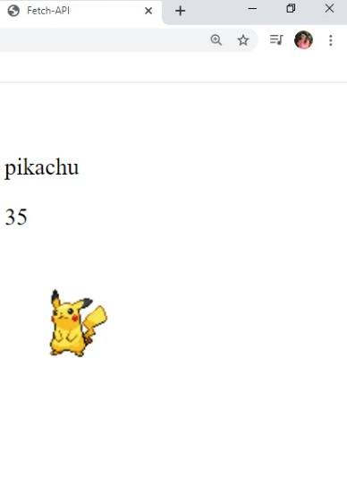

## My first FETCH-API

# Comsumir API Publica con JavaScript.

API Fetch: Es un nuevo estandar que viene a dar una alternativa para interactuar con el protocolo http. Fetch está basado en promesas y nos brinda mayor flexibilidad y capacidad de control a la hora de realizar llamadas al servidor.

Haremos una peticion a esta url y traeremos los datos de pokemon.

la sintaxis de Fetch es bastante sencilla. Recibe como parametro la url que para este caso la tenemos dentro de una constante pero podriamos pasarsela directamente 

ejemplo: fetch('https://pokeapi.co/api/v2/pokemon/1/')

entonces, la promesa seria .then y la respuesta vieen en json (response.json())

y en la siguiente promesa vamos a imprimirla en nuestra consola. para eso usamos data. Data es el resultado de nuestro JSON. En caso de un error un catch.

En el navegador observamos que ya tenemos la peticion.

Una vez traidos los datos. Creamos nuestro template para mostrar esos datos. En nuestro index tenemos un id=element. Y alli vamos a usar el template de strings. Colocamos una etiqueta p con el nombre e interpolamos y cerramos etiquetas. La interpolacion ocurre en las ${} alli solicitamos la data.

# Preview 

